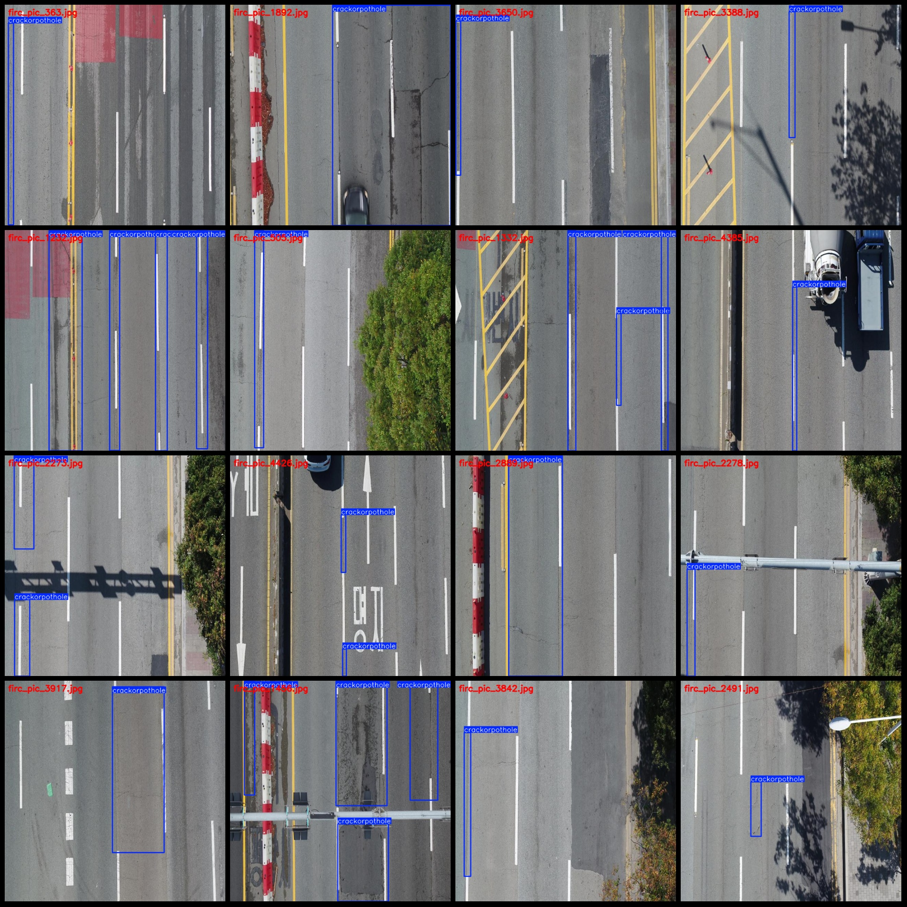
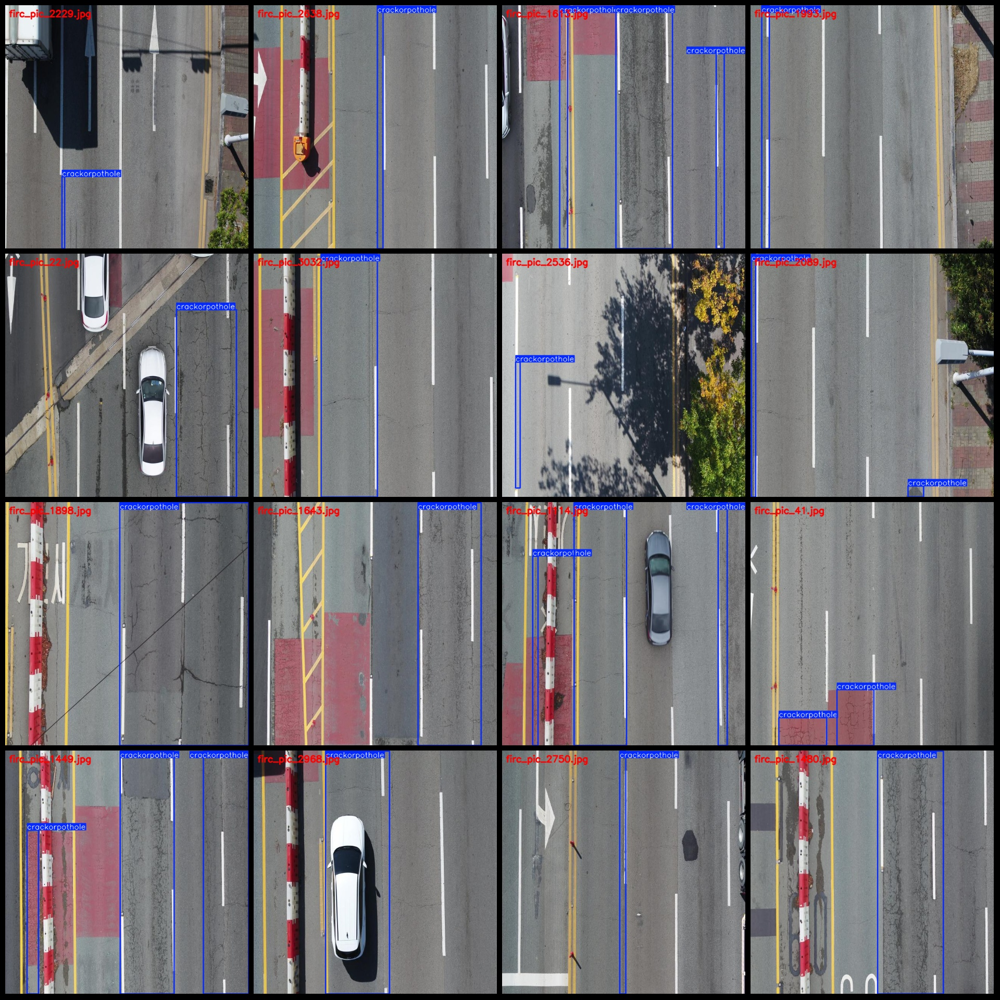

# Drone Viewpoint Aerial Photography Road Cracks and Cracked Surface Defect Detection Dataset VOC+YOLO Format: 4,444 Images in One Category

Dataset format: Pascal VOC format + YOLO format (txt file without split path, only containing jpg images along with corresponding VOC format xml files and YOLO format txt files)
Image count (number of jpg files): 4,444
Annotation count (number of xml files): 4,444
Annotation count (txt files): 4,444
Number of categories: 1
Categories: ["crackorpothole"]
Number of boxes per category: 7,500
Total number of boxes: 7,500
Number of images per category: 4,444
Image resolution: 640x640
Annotation tool used: labelImg
Annotation rules: Draw rectangle boxes for categories
Important note: The dataset does not have separate training validation test sets; users need to partition them themselves.
Special notice: This dataset does not guarantee the accuracy of models or weight files trained on this dataset.
Image preview:
Annotation example:

## Images

Here is a pay link on Stripe ( https://buy.stripe.com/3cs8yP7sY87d0vu9AB ). Please contact me lonlonago@foxmail.com after funding $89, and I will send you a complete data files , thank you!

